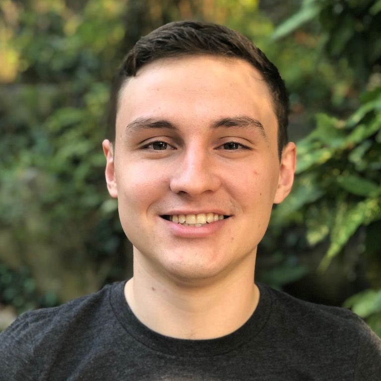
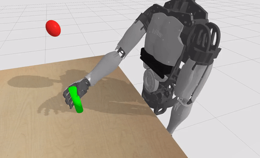
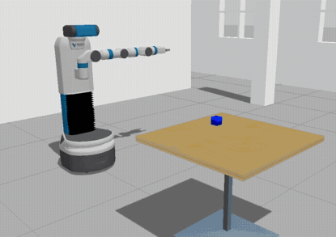
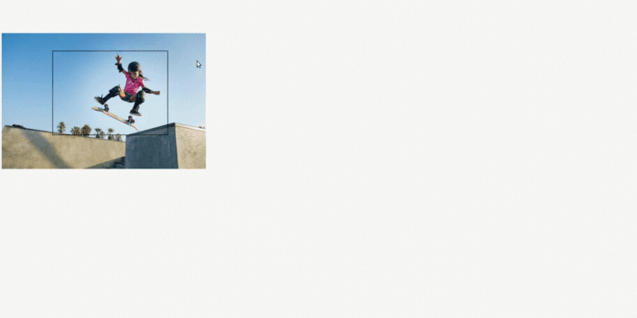

  

  	

  		
  		  
  		<i>Maks(im) Sorokin</i>
  		 
  		<a href="https://www.twitter.com/initmaks/">[Twitter]</a> <a href="https://github.com/initmaks/">[Github]</a>
  		 <a href="../misc/CV.pdf">[CV]</a>
  	

  

  

  	

  		 
  		My name is Maks, I'm MSCS student at Georgia Tech, working on Deep Reinforcement Learning for Vision based Manipulation with <a href="https://cs.stanford.edu/~karenliu/Home.html">Dr. Karen Liu</a> & <a href="https://wenhaoyu.weebly.com/">Wenhao Yu</a>, also Head TA-ing <a href="https://docs.google.com/document/d/e/2PACX-1vSfX11I1FjSvXfu7FdhdNa-XwHZx8HK4Ot-nM76dKWE85MB_y6xCN5XkjR-xycY6i4YB67K4Iw0Jkm2/pub">CS6601 AI class</a> by <a href="https://www.cc.gatech.edu/people/thomas-ploetz"> Dr. Thomas Ploetz</a> & <a href="https://www.cc.gatech.edu/home/thad/">Dr. Thad Starner</a>.
      <a><h2>News</h2></a>
  		  
        + I will be starting PhD in Robotics at Georgia Tech in <strong>Fall 2020</strong>!
  		 
  		<h2>Projects</h2>
  		 
  		

  			<!-- ################################################################################## -->
  			

  				
  			

  			

  				

  					<strong>Object Search using Vision based RL</strong> [in progress] - End-to-end vision based object search.
  				

  			

  			<!-- ################################################################################## -->
  			

  				
  			

  			

  				

  					<a href="https://github.com/initmaks/ran2can"><strong>Real2Sim Image adaptation</strong></a> - Image domain adaptation through the conversion of images with randomized textures (or real images) to a canonical image representation. Replication of a <a href="https://arxiv.org/abs/1812.07252">RCAN paper</a> with different loss modeling (GAN loss -> <a href="https://arxiv.org/abs/1603.08155">Perceptual/Feature Loss</a>).
  				

  			

  			<!-- ################################################################################## -->
  			

  				
  			

  			

  				

  					<a href="/page/learning_to_swing_with_rl"><strong>Learning to Swing</strong></a> - Computer Animation project, which utilizes off-the-shelf Soft-Actor-Critic Reinforcement Learning method to learn how to build up the momentum and swing the body on a pull up bar.
  				

  			

  			<!-- ################################################################################## -->
  			

  				
  			

  			

  				

  					<a href="/page/mobile_manipulation_course"><strong>FetchIt!</strong></a> - Mobile Manipulation project that utilises MoveIt! & GQ-CNN to grasp an object from the table using a Fetch Robot in the Gazebo Simulator.
  				

  			

  			<!-- ################################################################################## -->
  			

  				
  			

  			

  				

  					<a href="https://github.com/initmaks/Self-driving_car_ND/tree/master/Behavioral-Cloning"><strong>Behavioral Clonning for Autonomous Driving</strong></a> - End-to-end (image to steering wheel) control from data collected over multiple laps made by human in addition to multiple off-the-track recovery situations.
  				

  			

  			<!-- ################################################################################## -->
  			

  				
  			

  			

  				

  					<a href="https://github.com/initmaks/Self-driving_car_ND/tree/master/Advanced-Lane-Lines"><strong>Lane Marking Detection</strong></a> project which uses sobel filters, perspective transforms, and line fitting to extact and display lane boundaries.
  				

  			

  			<!-- ################################################################################## -->
  			

  				
  			

  			

  				

  					<strong>Panning</strong> - Computational Photography project, that allows user to automatically crop out the object of interest and apply panning effect based on the magnitude and direction provided.
  				

  			

  			<!-- ################################################################################## -->
		

	

  

