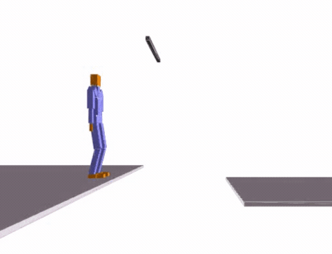

*In collaboration with [Theo Panagiotopoulos](http://www.theopanag.com/)*

This project is a Final Project of [Dr. Karen Liu](https://www.cc.gatech.edu/~karenliu/Home.html)'s [Computer Animation](https://www.cc.gatech.edu/~dellaert/18F-8803MM/Mobile_Manipulation_2018.html) class.

Off-the-shelf [Soft-Actor-Critic](https://spinningup.openai.com/en/latest/algorithms/sac.html) Off-policy Reinforcement Learning method  has been used to train body build up the momentum on a pull up bar.

The representation of the body (**State**) contains 39 positions and their relative velocities. **Action space** is a desired DOF position for `thigh, bicep, shin, forearm, toe, hand1&2, head`. Left and right parts of the body are "mirrored", i.e. left thigh and right thigh are initilized in the same relative configuration and both get the same displacement values/actions. **Reward** is continious and given as absolute velocity of pelvis around `z` axis.

NeuralNet consists of 1 layer Fully Connected layer of 256 neurons.

*Initial policy* (`0 mins of training`):

<iframe width="720" height="400" src="https://www.youtube.com/embed/ZrbnHCP0nVo" frameborder="0" allow="accelerometer; autoplay; encrypted-media; gyroscope; picture-in-picture" allowfullscreen></iframe>

*Intermediate policy* (`15 mins  of training`):

<iframe width="720" height="400" src="https://www.youtube.com/embed/dLxKjDKMoiI" frameborder="0" allow="accelerometer; autoplay; encrypted-media; gyroscope; picture-in-picture" allowfullscreen></iframe>

*Final policy* (`20 mins  of training`):

<iframe width="720" height="400" src="https://www.youtube.com/embed/N34kc6pcHq8" frameborder="0" allow="accelerometer; autoplay; encrypted-media; gyroscope; picture-in-picture" allowfullscreen></iframe>

